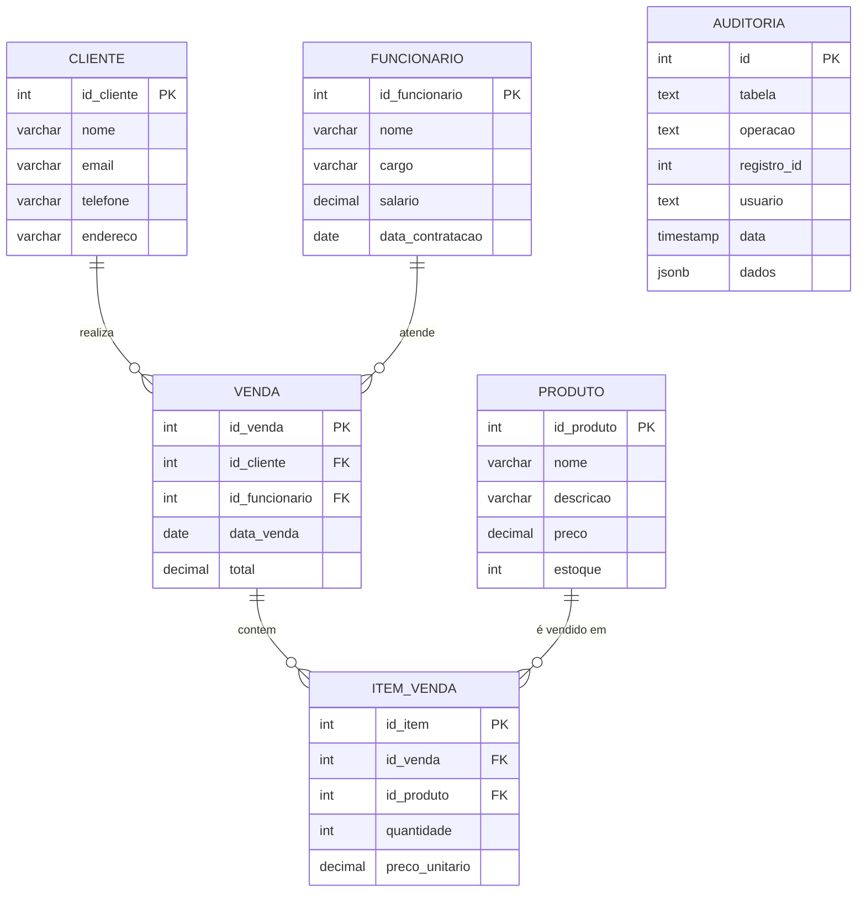

# Diagrama Entidade-Relacionamento - Sistema de Vendas

## Visão Geral
Este diagrama representa a estrutura do banco de dados para um sistema de vendas de auto peças, incluindo as entidades principais e seus relacionamentos.

## Diagrama ER

## Descrição das Entidades

### FUNCIONARIO
- **Descrição**: Representa os funcionários da empresa
- **Campos principais**: 
  - `id_funcionario`: Identificador único
  - `nome`: Nome completo do funcionário
  - `cargo`: Posição/função na empresa
  - `salario`: Remuneração mensal
  - `data_contratacao`: Data de início na empresa

### CLIENTE
- **Descrição**: Representa os clientes que compram produtos
- **Campos principais**:
  - `id_cliente`: Identificador único
  - `nome`: Nome completo do cliente
  - `email`: E-mail para contato
  - `telefone`: Número de telefone
  - `endereco`: Endereço completo

### PRODUTO
- **Descrição**: Representa os produtos disponíveis para venda (auto peças)
- **Campos principais**:
  - `id_produto`: Identificador único
  - `nome`: Nome do produto
  - `descricao`: Descrição detalhada
  - `preco`: Preço unitário
  - `estoque`: Quantidade disponível

### VENDA
- **Descrição**: Representa uma transação de venda
- **Campos principais**:
  - `id_venda`: Identificador único
  - `id_cliente`: Referência ao cliente que comprou
  - `id_funcionario`: Referência ao funcionário que atendeu
  - `data_venda`: Data da transação
  - `total`: Valor total da venda

### ITEM_VENDA
- **Descrição**: Representa os itens específicos de cada venda
- **Campos principais**:
  - `id_item`: Identificador único
  - `id_venda`: Referência à venda
  - `id_produto`: Referência ao produto vendido
  - `quantidade`: Quantidade vendida
  - `preco_unitario`: Preço do produto no momento da venda

### AUDITORIA
- **Descrição**: Tabela de log para rastreamento de mudanças
- **Campos principais**:
  - `id`: Identificador único
  - `tabela`: Nome da tabela modificada
  - `operacao`: Tipo de operação (INSERT, UPDATE, DELETE)
  - `registro_id`: ID do registro modificado
  - `usuario`: Usuário que fez a modificação
  - `data`: Timestamp da modificação
  - `dados`: Dados em formato JSON

## Relacionamentos

1. **CLIENTE → VENDA** (1:N)
   - Um cliente pode realizar várias vendas
   - Uma venda pertence a um único cliente

2. **FUNCIONARIO → VENDA** (1:N)
   - Um funcionário pode atender várias vendas
   - Uma venda é atendida por um único funcionário

3. **VENDA → ITEM_VENDA** (1:N)
   - Uma venda pode conter vários itens
   - Um item de venda pertence a uma única venda

4. **PRODUTO → ITEM_VENDA** (1:N)
   - Um produto pode estar em vários itens de venda
   - Um item de venda refere-se a um único produto

## Regras de Negócio

1. Toda venda deve ter pelo menos um item
2. O total da venda é calculado pela soma dos valores dos itens (quantidade × preço_unitário)
3. O estoque do produto deve ser atualizado a cada venda
4. Todas as operações nas tabelas principais são auditadas
5. Um funcionário deve estar cadastrado para realizar vendas
6. Um cliente deve estar cadastrado para realizar compras